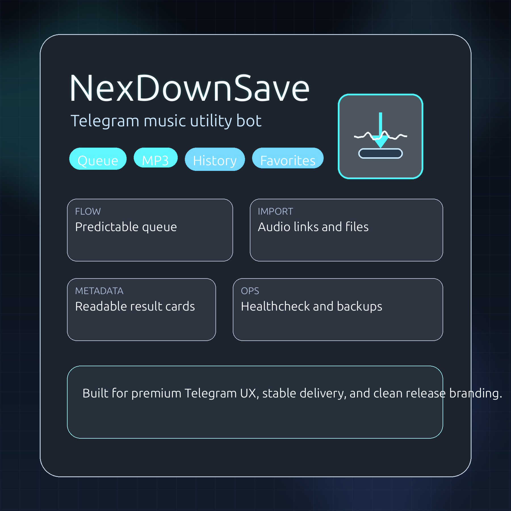

# NexDownSave

<p align="center">
  
</p>

<p align="center">
  
</p>

NexDownSave is a release-ready Telegram bot for direct audio links and uploaded audio files. It is built for clean UX, predictable processing, and production deployment on Ubuntu.

## Highlights

- Russian-first branded Telegram UX
- paginated history and favorites
- in-bot library search
- Queue-based job processing with retry attempts
- MP3 conversion via `ffmpeg`
- Metadata-rich result cards via `ffprobe`
- stronger uploaded-file validation before conversion
- SQLite persistence for users, stats, history, and favorites
- `.env` support without extra runtime dependencies
- Rotating logs, healthcheck, database backup, and `systemd` service support
- local brand asset generation for logo, banner, avatar, splash, and promo card

## Brand direction

NexDownSave positions itself as a fast and clean music utility bot:

- direct audio file intake
- minimal friction in chat
- stable queue processing
- operational visibility for admins

## Repository layout

- `bot.py` - entry point
- `app/config.py` - settings and `.env` loading
- `app/main.py` - Telegram handlers, queue, UX, orchestration
- `app/services.py` - downloading, conversion, metadata extraction
- `app/db.py` - SQLite persistence
- `app/keyboards.py` - inline keyboards
- `healthcheck.py` - runtime health probe
- `backup_db.sh` - SQLite backup utility
- `deploy/nexdownsave.service` - `systemd` service file
- `scripts/generate_brand_assets.py` - local PNG brand asset generator
- `assets/brand/` - generated logo and cover graphics

## Brand assets

<p align="center">
  
</p>

- Logo: `assets/brand/nexdownsave-logo.png`
- GitHub banner: `assets/brand/github-banner.png`
- Telegram avatar: `assets/brand/telegram-avatar.png`
- Start splash: `assets/brand/start-splash.png`
- Promo card: `assets/brand/promo-card.png`
- Social square: `assets/brand/social-square.png`
- Social wide: `assets/brand/social-wide.png`

## Requirements

- Python 3.10+
- `ffmpeg`
- `ffprobe`
- `curl`
- `sqlite3`

## Quick start

```bash
sudo apt update
sudo apt install -y python3 python3-venv ffmpeg curl sqlite3
cd /home/casperhood/.codex/NexDownSave
python3 -m venv venv
source venv/bin/activate
pip install -U pip
pip install -r requirements.txt
cp .env.example .env
python3 bot.py
```

Edit `.env` before first production run.

## Environment

See `.env.example`.

Main variables:

- `BOT_TOKEN`
- `ADMIN_USER_IDS`
- `MAX_FILE_MB`
- `DOWNLOAD_TIMEOUT`
- `FFMPEG_TIMEOUT`
- `HISTORY_LIMIT`
- `RETRY_ATTEMPTS`
- `QUEUE_POLL_INTERVAL`

## Local management

Use either `make` or `run.sh`.

### Makefile

```bash
make help
make install
make env
make run
make health
make backup
make brand-assets
```

### run.sh

```bash
./run.sh setup
./run.sh env
./run.sh run
./run.sh health
./run.sh backup
./run.sh brand-assets
```

## Production deployment

Use `deploy/install.sh` for first-time VPS setup or `make service-install` for an existing machine.


### systemd

```bash
./deploy/install.sh
sudo systemctl enable --now nexdownsave
journalctl -u nexdownsave -f
```

### journald logs

```bash
journalctl -u nexdownsave -f
```

### healthcheck

```bash
./venv/bin/python healthcheck.py
```

### database backup

```bash
./backup_db.sh
```

Optional cron example:

```bash
0 */6 * * * /opt/nexdownsave/backup_db.sh
```

## Bot commands

- `/start`
- `/help`
- `/stats`
- `/history`
- `/favorites`
- `/search <text>`
- `/status`
- `/admin`

## Scope

NexDownSave supports:

- direct links to audio files
- audio files uploaded by the user

It does not support general webpage extraction or unsupported media sources.

## Security notes

- use a fresh Telegram bot token
- do not commit `.env`
- keep `data/` out of public repos unless sanitized

## License

                  3wS hlhzk
