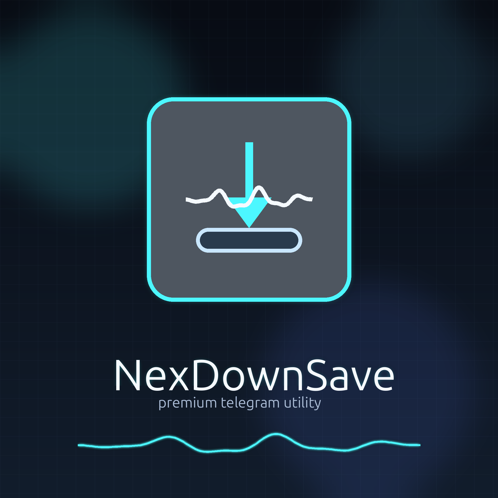
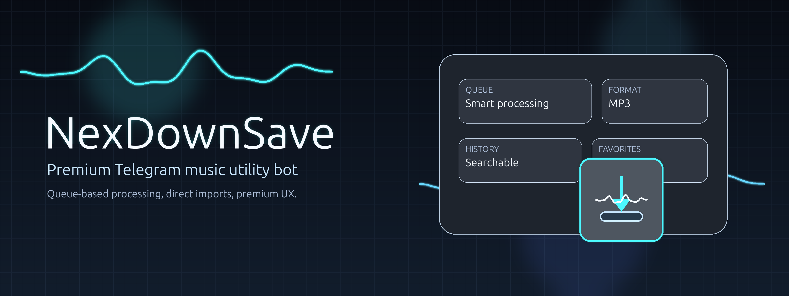

# NexDownSave

<p align="center">
  
</p>

<p align="center">
  
</p>

NexDownSave is a production-oriented Telegram bot for track links, public music pages, and uploaded audio files. It focuses on predictable processing, clean Russian-first UX, and maintainable deployment on Ubuntu and Bothost.

## Highlights

- Russian-first branded Telegram UX
- **search by track name** — type a query, pick a numbered result, get MP3
- **vibe search** — `/vibe rainy night, instrumental, ~90 BPM` → an AI-curated set, personalized from your history (Claude + lexicon fallback)
- **inline mode** — `@bot track name` works in any chat
- **instant re-send from cache** — already processed tracks return immediately via Telegram `file_id`
- safe HTML-formatted bot responses without Markdown escaping bugs
- direct audio links and public track page links via `yt-dlp`
- paginated history and favorites
- queue overview with `/queue` and in-bot menu shortcut
- user-side queue cleanup via `/cancel` and menu button
- repeat for both links and previously uploaded files
- queue-based job processing with backpressure via `QUEUE_MAXSIZE`
- MP3 conversion via `ffmpeg`
- metadata-rich result cards via `ffprobe`
- stronger uploaded-file validation before conversion
- SQLite persistence for users, stats, history, and favorites
- rotating logs, healthcheck, database backup, and `systemd` service support
- local unit tests and GitHub Actions CI
- local brand asset generation for logo, banner, avatar, splash, and promo card

## Repository layout

- `bot.py` - entry point
- `app/config.py` - settings and `.env` loading
- `app/main.py` - Telegram handlers, queue, UX, and orchestration
- `app/services.py` - downloading, extraction, conversion, and metadata handling
- `app/db.py` - SQLite persistence
- `app/keyboards.py` - inline keyboards
- `healthcheck.py` - runtime health probe
- `backup_db.sh` - SQLite backup utility
- `Dockerfile` - container build for Bothost and Docker deploys
- `deploy/nexdownsave.service` - `systemd` service file
- `deploy/install.sh` - first-time VPS setup helper
- `tests/` - unit tests for critical logic
- `.github/workflows/ci.yml` - basic CI pipeline

## Requirements

- Python 3.10+
- `ffmpeg`
- `ffprobe`
- `curl`
- `sqlite3`

Python dependencies are installed from `requirements.txt`, including `yt-dlp` for public track page extraction.

## Quick start

```bash
sudo apt update
sudo apt install -y python3 python3-venv ffmpeg curl sqlite3
cd /home/casperhood/.codex/NexDownSave
python3 -m venv venv
source venv/bin/activate
pip install -U pip
pip install -r requirements.txt
cp .env.example .env
python3 bot.py
```

Edit `.env` before first production run.

## Environment

See [`.env.example`](/home/casperhood/.codex/NexDownSave/.env.example).

Main variables:

- `BOT_TOKEN`
- `ADMIN_USER_IDS`
- `MAX_FILE_MB`
- `DOWNLOAD_TIMEOUT`
- `FFMPEG_TIMEOUT`
- `HISTORY_LIMIT`
- `RETRY_ATTEMPTS`
- `QUEUE_POLL_INTERVAL`
- `QUEUE_MAXSIZE`
- `SEARCH_TIMEOUT`
- `SEARCH_RESULTS`
- `ANTHROPIC_API_KEY` (optional — enables AI vibe search)
- `AI_MODEL` (default `claude-haiku-4-5`)
- `VIBE_QUERIES`
- `VIBE_RESULTS`

## Local management

Use either `make` or `run.sh`.

### Makefile

```bash
make help
make install
make env
make test
make check
make run
make health
make backup
make brand-assets
```

### run.sh

```bash
./run.sh setup
./run.sh env
./run.sh test
./run.sh check
./run.sh run
./run.sh health
./run.sh backup
./run.sh brand-assets
```

## Testing

```bash
cd /home/casperhood/.codex/NexDownSave
python3 -m unittest discover -s tests -p 'test_*.py'
python3 -m compileall .
```

## Bothost deployment

Bothost builds bots inside Docker containers and supports custom `Dockerfile`. This repository includes a ready-to-use container build for Bothost with `ffmpeg`, `curl`, `sqlite3`, `yt-dlp`, and persistent data in `/app/data`.

### What to configure in Bothost

1. Create a bot from GitHub repository URL: `https://github.com/Apostasy89/nexdexdown.git`
2. Branch: `main`
3. Build mode: custom `Dockerfile`
4. Add environment variables in the Bothost dashboard:
   - `BOT_TOKEN`
   - `ADMIN_USER_IDS`
   - optional: `MAX_FILE_MB`, `DOWNLOAD_TIMEOUT`, `FFMPEG_TIMEOUT`, `QUEUE_MAXSIZE`
5. Keep database and logs in the default container paths:
   - `DB_PATH=/app/data/music_bot.sqlite3`
   - `LOG_PATH=/app/data/bot.log`

### Recommended Bothost environment variables

```text
BOT_TOKEN=123456789:AA...
ADMIN_USER_IDS=123456789
DB_PATH=/app/data/music_bot.sqlite3
LOG_PATH=/app/data/bot.log
QUEUE_MAXSIZE=100
MAX_FILE_MB=50
DOWNLOAD_TIMEOUT=180
FFMPEG_TIMEOUT=300
```

## Production deployment

Use `deploy/install.sh` for first-time VPS setup or `make service-install` for an existing machine.

### systemd

```bash
sudo cp deploy/nexdownsave.service /etc/systemd/system/nexdownsave.service
sudo systemctl daemon-reload
sudo systemctl enable --now nexdownsave
sudo systemctl status nexdownsave
```

### journald logs

```bash
journalctl -u nexdownsave -f
```

### healthcheck

```bash
/home/casperhood/.codex/NexDownSave/venv/bin/python /home/casperhood/.codex/NexDownSave/healthcheck.py
```

For first deployment before the database exists:

```bash
/home/casperhood/.codex/NexDownSave/venv/bin/python /home/casperhood/.codex/NexDownSave/healthcheck.py --allow-missing-db
```

### database backup

```bash
/home/casperhood/.codex/NexDownSave/backup_db.sh
```

Optional cron example:

```bash
0 */6 * * * /home/casperhood/.codex/NexDownSave/backup_db.sh
```

## Bot commands

- `/start`
- `/help`
- `/stats`
- `/queue`
- `/cancel`
- `/history`
- `/favorites`
- `/search <text>`
- `/vibe <description>`
- `/status`
- `/admin`

## Search and inline mode

- **Search by name:** send any non-link text. NexDownSave runs a `yt-dlp` `ytsearch`
  query, shows numbered results, and downloads the one you pick.
- **Inline mode:** type `@your_bot track name` in any chat. Already cached tracks are
  returned instantly as audio; for new queries an article opens the bot via a deep link
  and runs the search there.
- **Enable inline in BotFather:** send `/setinline` to @BotFather, pick the bot, and set a
  placeholder (for example `название трека...`). Inline replies will not appear until this
  is enabled.
- **Cache:** the first successful download of a track stores its Telegram `file_id` in the
  `tracks` table, so repeats and inline hits are instant and skip re-downloading.

## Vibe search (AI)

- **Command:** `/vibe <description>` — e.g. `/vibe дождливая ночь, инструментал, ~90 BPM`.
  An empty `/vibe` builds a set purely from the user's listening history.
- **How it works:** a free-form mood/activity description is turned into several concrete
  search queries (semantic interpretation), each is run through the `yt-dlp` search, and the
  results are de-duplicated into one curated set. The user's recent downloads and favorites
  bias the result toward their taste.
- **AI tier:** with `ANTHROPIC_API_KEY` set, interpretation uses Claude
  (`AI_MODEL`, default `claude-haiku-4-5`, ~$0.005/request) via the official `anthropic` SDK
  with structured JSON output. **Without a key it degrades gracefully** to a built-in
  deterministic mood→genre lexicon — the feature always works, the AI just makes it sharper.
- **Config:** `VIBE_QUERIES` (queries per request), `VIBE_RESULTS` (tracks in the set).

## Scope

NexDownSave supports:

- search by track name over public sources via `yt-dlp`
- direct links to audio files
- public pages with track audio supported by `yt-dlp`
- audio files uploaded by the user
- inline delivery of previously cached tracks

It does not bypass DRM, private content, or unsupported media sources.

## Security notes

- use a fresh Telegram bot token
- do not commit `.env`
- keep `data/` out of public repos unless sanitized
- keep `QUEUE_MAXSIZE` realistic to avoid disk pressure during bursts

## License

MIT
